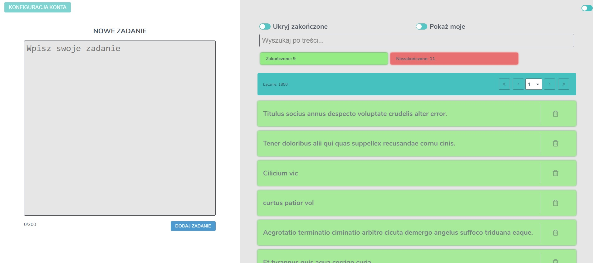
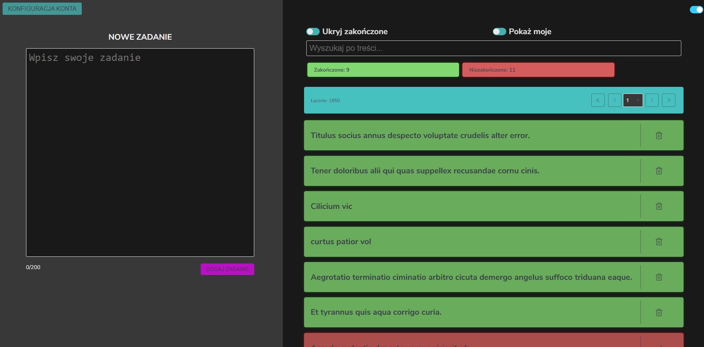
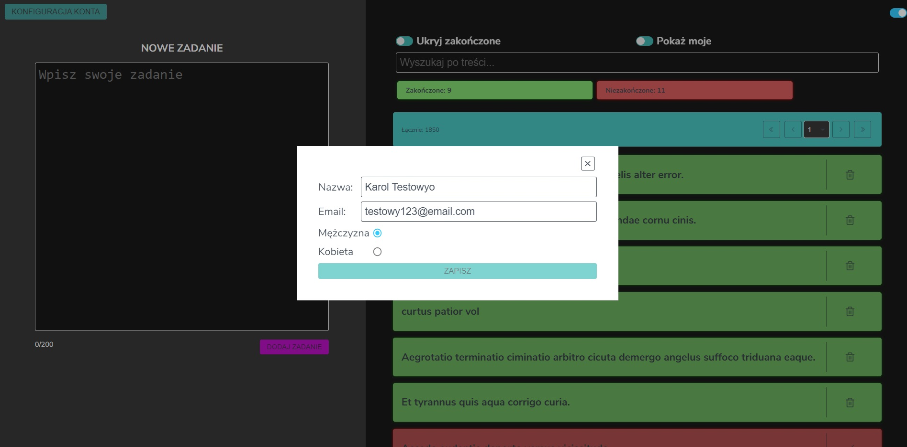

# Todo Task

The application was created as part of a recruitment task for a junior frontend developer

## Table of contents

- [General info](#general-info)
  - [Screenshotss](#screenshots)
  - [Technologies and libraries](#technologies-and-libraries)
- [Getting Started](#getting-started)
  - [Installation](#installation)
  - [Available Scripts](#available-scripts)
- [Features](#features)
- [Status](#status)
- [License](#license)
- [Contact](#contact)

## General info

The application was created as part of a recruitment task for a junior frontend developer. As part of the task Create a TODO list in React.js with CRUD (https://gorest.co.in/).

### Technologies and libraries

- React
- Recoil
- theme-ui
- react-hook-form
- ramda

### Screenshots - Design of application

Home view

Home dark view

Edit profile view

Todo details

Edit todo details

## Getting Started

The easiest way to get started is to follow few step to install all dependencies and run the projects

### Installation

1. After cloning or extracting the .zip files of this repository go to root directory:

2. Install all dependencies:
   `yarn install`

3. Rename `.env` to `.env.local` and paste your API_KEY:
   `REACT_APP_API_KEY=YOUR_API_KEY`

4. You can run the project in the developer mode:
   `yarn start`

### Available Scripts

In the project directory, you can run:

1.  `yarn start`

Runs the app in the development mode. Open [http://localhost:3000](http://localhost:3000) to view it in the browser. The page will reload if you make edits. You will also see any lint errors in the console.

2.  `yarn test`

Launches the test runner in the interactive watch mode. See the section about [running tests](https://facebook.github.io/create-react-app/docs/running-tests) for more information.

3.  `yarn build`

Builds the app for production to the `build` folder. It correctly bundles React in production mode and optimizes the build for the best performance. The build is minified and the filenames include the hashes. Your app is ready to be deployed!

See the section about [deployment](https://facebook.github.io/create-react-app/docs/deployment) for more information.

4.  `yarn eject`

If you aren’t satisfied with the build tool and configuration choices, you can `eject` at any time. This command will remove the single build dependency from your project.

**Note: this is a one-way operation. Once you `eject`, you can’t go back!**

## Features

**Todo**:

- Browse the list of todos
- Filtering the list (hiding completed, showing mine - assigned to the email)
- Search by title
- Number of total completed and uncompleted
- Adding a new todo
- Preview of todo details
- Editing existing todo
- Deleting existing todo

**Other**:

- Toggle theme (light/dark))
- Change user (Default is Karol Testowy, user changed when we change email)
- User persist

## Status

The project is ready (Unit and integration tests can be added in the future).

## License

Distributed under the MIT License.

## Contact

Created by:

Robert Jaskólski

Feel free to contact me!

## Getting Started with Create React App

This project was bootstrapped with [Create React App](https://github.com/facebook/create-react-app).
